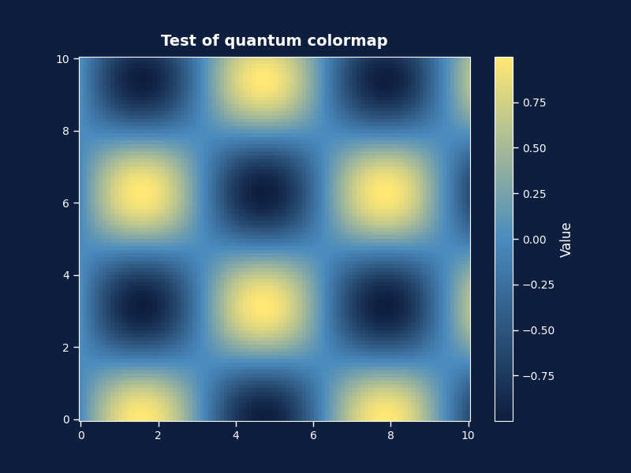
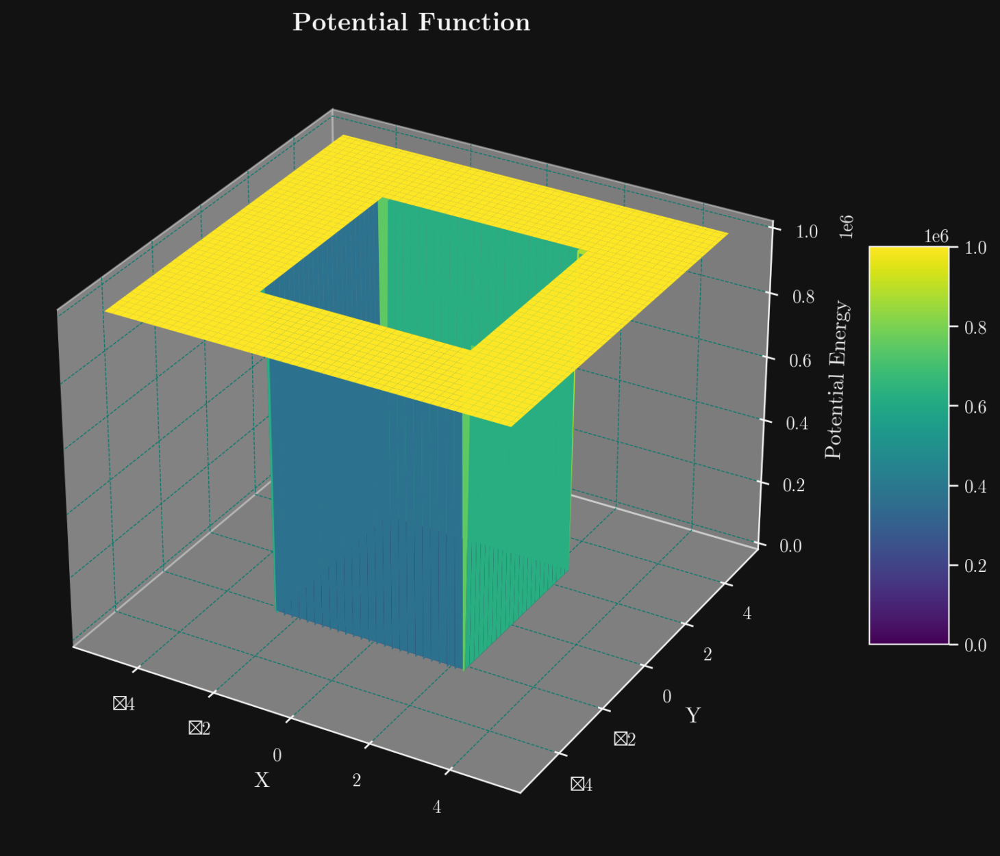
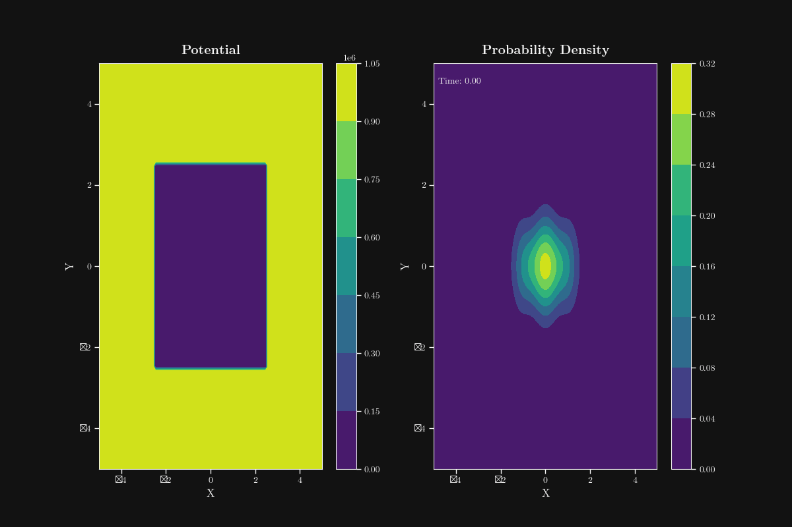
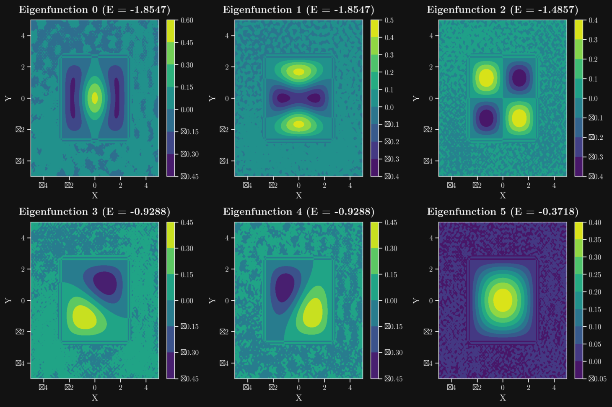

# Schrödinger Equation Solver 🔬

[](https://www.python.org/downloads/)
[](https://streamlit.io/)
[](https://numpy.org/)
[](https://scipy.org/)
[](https://opensource.org/licenses/MIT)



## 📊 Visualization Examples

### 1D Visualization

*Visualization of eigenstates and potential for a harmonic oscillator in 1D, showing multiple energy levels with their corresponding wave functions.*

### 2D Visualization

*Visualization of eigenstates for a 2D infinite well, showing contour plots of the probability density for different energy levels.*

### Time Evolution

*Animation of a Gaussian wave packet evolving in a potential well, demonstrating quantum dynamics over time.*

### 3D Surface Plot

*3D surface plot of a 2D potential function, showing the shape of the potential energy surface.*

## 🌐 Documentation in Multiple Languages

This interactive application solves the time-independent Schrödinger equation and visualizes the eigenstates and time evolution of quantum states for various potentials in 1D and 2D.

Please select your preferred language to view the complete documentation:

### 🇬🇧 [English Documentation](docs/README.en.md)

### 🇫🇷 [Documentation en Français](docs/README.fr.md)

### 🇪🇸 [Documentación en Español](docs/README.es.md)

## ✨ Key Features

- Solves the time-independent Schrödinger equation in 1D and 2D
- Interactive visualization of wave functions, probability densities, and energy levels
- Time evolution animation of quantum states
- Multiple potential types (infinite well, harmonic oscillator, double well, etc.)
- User-friendly Streamlit interface

## 🚀 Quick Start

```bash
# Clone the repository
git clone https://github.com/Illuminatyon/SchrodingerEquationVisualiser.git
cd SchrodingerEquationVisualiser

# Install dependencies
pip install -r requirements.txt

# Run the application
python run_streamlit.py
```

For detailed installation and usage instructions, please refer to the documentation in your preferred language.

## 📄 License

This project is licensed under the MIT License - see the [LICENSE](LICENSE) file for details.

---

Created with ❤️ using Python and Streamlit