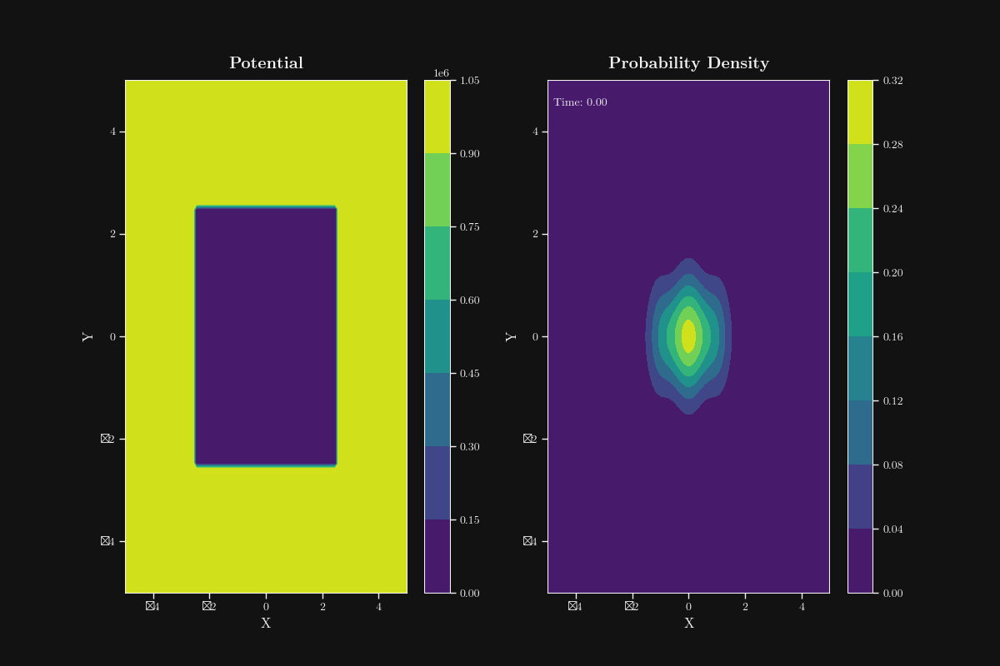

# Schrödinger Equation Solver 🔬

[](https://www.python.org/downloads/)
[](https://streamlit.io/)
[](https://numpy.org/)
[](https://scipy.org/)
[](https://opensource.org/licenses/MIT)

## 🇬🇧 English

This interactive application solves the time-independent Schrödinger equation and visualizes the eigenstates and time evolution of quantum states for various potentials in 1D and 2D.


## 📊 Visualization Examples

### 1D Visualization

*Visualization of eigenstates and potential for a harmonic oscillator in 1D, showing multiple energy levels with their corresponding wave functions.*

### 2D Visualization

*Visualization of eigenstates for a 2D infinite well, showing contour plots of the probability density for different energy levels.*

### Time Evolution

*Animation of a Gaussian wave packet evolving in a potential well, demonstrating quantum dynamics over time.*

### 3D Surface Plot

*3D surface plot of a 2D potential function, showing the shape of the potential energy surface.*

### ✨ Features

- **Comprehensive Solver**: Solves the time-independent Schrödinger equation in 1D and 2D
- **Interactive Visualization**: Displays wave functions, probability densities, and energy levels
- **Time Evolution**: Animates quantum state evolution over time
- **Multiple Potentials**:
  - Infinite well
  - Potential barrier
  - Harmonic oscillator
  - Double well (tunneling effect)
  - Morse potential (1D only)
  - Circular well (2D only)
- **Educational Theory Section**:
  - Detailed explanation of the Schrödinger equation and its forms
  - Properties of the equation (linearity, unitarity, probability current)
  - Examples of quantum systems with mathematical solutions
  - Historical context of the equation's development
  - Different interpretations of quantum mechanics
- **User-Friendly Interface**: Streamlit-based UI for interactive parameter adjustment
- **Multi-language Support**: Available in English, French, and Spanish

### 🔧 Installation

```bash
# Clone the repository
git clone https://github.com/Illuminatyon/SchrodingerEquationVisualiser.git
cd SchrodingerEquationVisualiser

# Create a virtual environment
python -m venv venv
# On Windows:
venv\Scripts\activate
# On macOS/Linux:
# source venv/bin/activate

# Install dependencies
pip install -r requirements.txt
```

### 📋 Requirements

- Python 3.7+
- NumPy
- SciPy
- Matplotlib
- Streamlit

See `requirements.txt` for the complete list of dependencies.

### 🚀 Usage

#### Streamlit Interface (Recommended)

```bash
# Run with warning suppression
python run_streamlit.py

# Or directly with Streamlit
streamlit run streamlit_app.py
```

#### Command Line

```bash
python -m schrodinger_solver.main --dimension=1 --potential=harmonic --n_points=1000
```

### 📁 Project Structure

- `schrodinger_solver/` - Main package
  - `core.py` - Core functions for solving the equation
  - `potentials.py` - Implementation of different potentials
  - `solver_1d.py` - 1D equation solver
  - `solver_2d.py` - 2D equation solver
  - `main.py` - Main entry point
- `streamlit_app.py` - Streamlit application
- `run_streamlit.py` - Wrapper script to run the Streamlit app with suppressed warnings
- `custom_mpl_style.py` - Custom Matplotlib styling
- `requirements.txt` - Project dependencies

### 📚 Theoretical Background

The time-independent Schrödinger equation is a fundamental equation in quantum mechanics that describes the wave function of a quantum-mechanical system:

$$-\frac{\hbar^2}{2m}\nabla^2\psi + V(\mathbf{r})\psi = E\psi$$

where:
- $\psi$ is the wave function
- $\hbar$ is the reduced Planck constant
- $m$ is the particle mass
- $V(\mathbf{r})$ is the potential energy
- $E$ is the energy eigenvalue
- $\nabla^2$ is the Laplacian operator

In one dimension, the equation simplifies to:

$$-\frac{\hbar^2}{2m}\frac{d^2\psi}{dx^2} + V(x)\psi = E\psi$$

This application uses numerical methods to solve this equation for various potential functions and visualize the resulting eigenstates.

## 📄 License

This project is licensed under the MIT License - see the [LICENSE](../LICENSE) file for details.

---

Created with ❤️ using Python and Streamlit